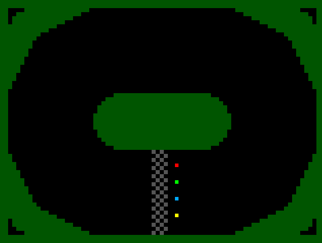

   

# Zuzel game by Piotr Kamiński created in 1996 ported to pure silicon architecture sponsored by IEEE
[Watch game play of original game here](https://www.youtube.com/watch?v=TAxoQyd6Lxc)

Custom CPU architecture was designed to fit complete project on a small area of silicon (100 um x 160 um).

## How it works

A motor track racing game for up to 4 players.
Each player controls his/her bike using a single input pin: 0 - straight+accelerate, 1 - turn left+brake.
Outpace your opponents and don't fall out of the track!

## How to test

Connect to VGA. Reset to start a new race. Use Input pins 0..3 to control motobikes.

## External hardware

- VGA output PMOD
- 4 input signals from physical switches (active 1) on Input[3:0]
